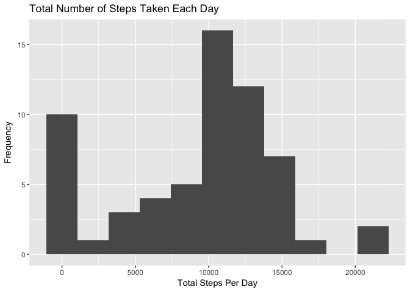
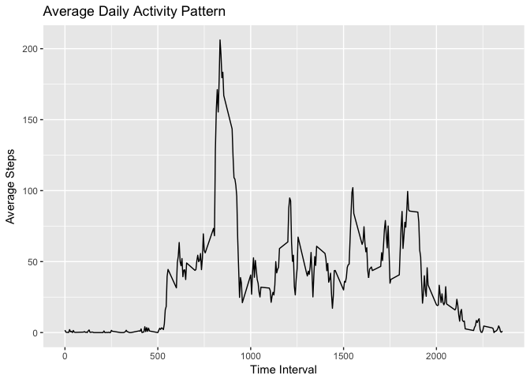
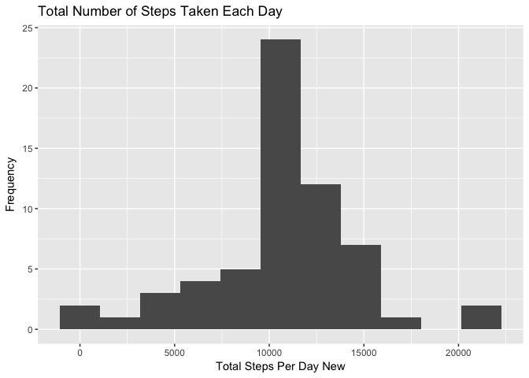
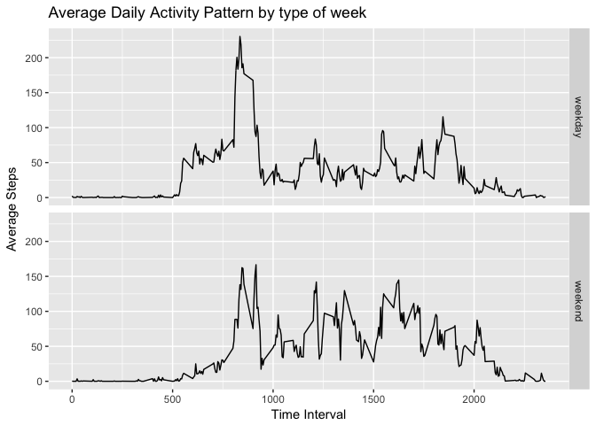

# Reproducible Research: Peer Assessment 1


## Loading and preprocessing the data
Check to see if data already exists. If not, the activity.csv file is extracted from the zip file. The .csv file is then read and loaded into `act` dataframe.

```r
act<-read.csv("activity.csv")
act <- transform(act, date = as.Date(act$date, format = "%Y-%m-%d"))
```

## What is mean total number of steps taken per day?

```r
library(ggplot2)
hist1<-aggregate(act$steps, by = list(act$date), sum,na.rm = TRUE)
names(hist1)<-c("Date","Sum")
qplot(Sum,data=hist1,xlab = "Total Steps Per Day",ylab = "Frequency", main = "Total Number of Steps Taken Each Day",binwidth = max(hist1$Sum/10))
```

<!-- -->


```r
stepsMean<-round(mean(hist1$Sum))
stepsMedian<-median(hist1$Sum)
```
The mean total number of steps taken per day is **9354**.  
The median total number of steps taken per day is **10395**.

## What is the average daily activity pattern?

```r
avgSteps <- aggregate(list(steps = act$steps), list(interval = act$interval), mean, na.rm = TRUE)
g2<-ggplot(avgSteps, aes(interval, steps))
g2+ geom_line() + xlab("Time Interval") +
      ylab("Average Steps") + ggtitle("Average Daily Activity Pattern") 
```

<!-- -->


```r
stepsMax<-avgSteps[which.max(avgSteps$steps),]
intervalMax<-stepsMax[[1,1]]
```
The 5-minute interval with the maximum number of average steps taken across all days in dataset is **835**.

## Imputing missing values

```r
naCount<-nrow(act[is.na(act),])
```
Total number of missing values in dataset is **2304**.

**Devise a strategy for filling in all of the missing values in the dataset.**

We will replace the missing values with the mean number of steps taken across all days for the corresponding time intervals.

**Create a new dataset that is equal to the original dataset but with the missing data filled in.**

New data set `act1` is created by copying `act` first, and then replacing the values with the corresponding interval averages.


```r
actNa<-which(is.na(act))
act1<-act
act1$steps[actNa] <- avgSteps$steps
```

**Make a histogram of the total number of steps taken each day and Calculate and report the mean and median total number of steps taken per day. Do these values differ from the estimates from the first part of the assignment? What is the impact of imputing missing data on the estimates of the total daily number of steps?**  

Histogram of the total number of steps taken each day from new dataset

```r
hist2<-aggregate(act1$steps, by = list(act1$date), sum)
names(hist2)<-c("Date","Sum")
qplot(Sum,data=hist2,xlab = "Total Steps Per Day New",ylab = "Frequency", main = "Total Number of Steps Taken Each Day",binwidth = max(hist2$Sum/10))
```

<!-- -->

```r
stepsMean1<-format(mean(hist2$Sum),scientific = FALSE)
stepsMedian1<-format(median(hist2$Sum),scientific = FALSE)
```
The new mean total number of steps taken per day is **10766.19**, whereas the previous mean was 9354.  
The new median total number of steps taken per day is **10766.19**, whereas the previous median was 10395.  

Imputing the missing values resulted in the estmates of the total number of steps to be larger than than previously calculated. This is a reasonable result, since previously the missing datapoints were disregarded completely. Adding these results back in will increase the mean and median regardless of magnitude.

## Are there differences in activity patterns between weekdays and weekends?
**Create a new factor variable in the dataset with two levels -- "weekday" and "weekend" indicating whether a given date is a weekday or weekend day.**


```r
library(dplyr)
```

```
## 
## Attaching package: 'dplyr'
```

```
## The following objects are masked from 'package:stats':
## 
##     filter, lag
```

```
## The following objects are masked from 'package:base':
## 
##     intersect, setdiff, setequal, union
```

```r
act2<-mutate(act1,type= NA)
for(i in 1:length(act1$date)){
    if(weekdays(act1$date[i]) %in% c("Monday", "Tuesday", "Wednesday", "Thursday", "Friday"))
    {act2$type[i]<-"weekday"
    }
else{ act2$type[i]<-"weekend"
}
}
```

**Make a panel plot containing a time series plot of the 5-minute interval (x-axis) and the average number of steps taken, averaged across all weekday days or weekend days (y-axis).**

```r
avgSteps1 <- aggregate(list(steps = act2$steps), list(interval = act2$interval,type=act2$type), mean)
g3<-ggplot(avgSteps1, aes(interval, steps))
g3+ geom_line() + xlab("Time Interval") + ylab("Average Steps") + ggtitle("Average Daily Activity Pattern by type of week") + facet_grid(type~.)
```

<!-- -->

